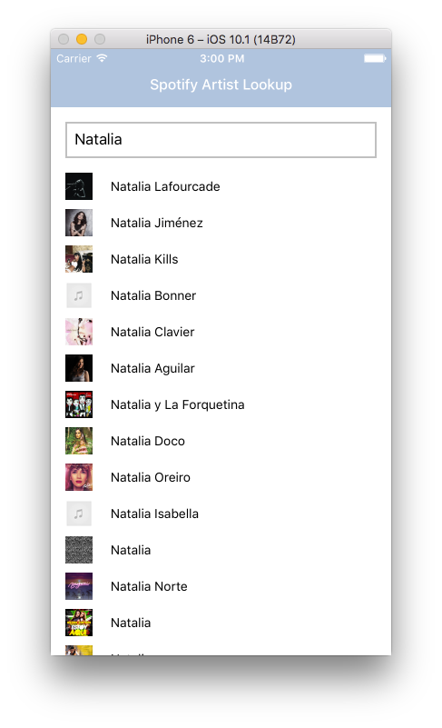

# MusicMan
An iOS and Android app looks up artists in Spotify. Created with React Native.

## How does it look like?

## Getting Started

1. npm install -g react-native-cli
2. git clone https://github.com/5555482/MusicMan
3. npm install
4. run `react-native run-android`
5. Enjoy

## Resources Used

* [React Native](https://github.com/facebook/react-native)
* [Detailed Look at React Native](https://www.youtube.com/watch?v=cuMezEwKFLU)
